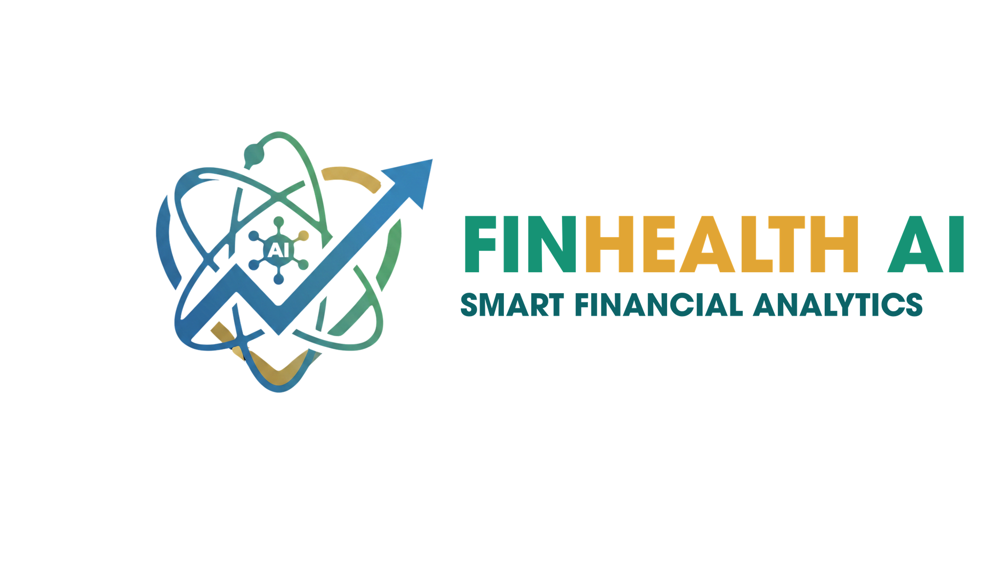
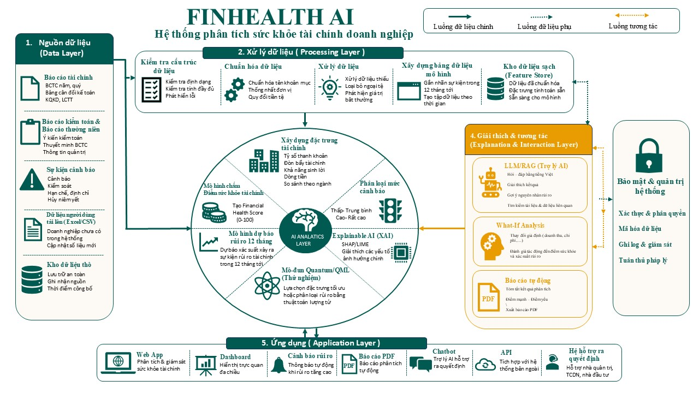
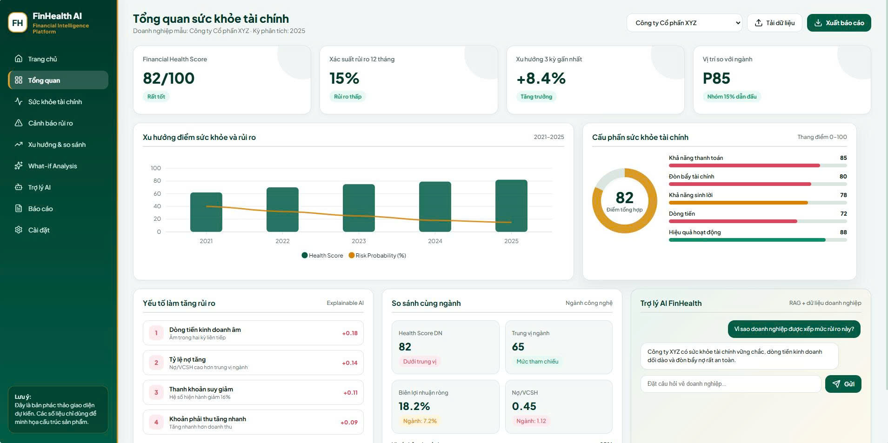

# FinHealth AI - Hệ thống AI phân tích sức khỏe tài chính doanh nghiệp

---

## 1. Tên và Logo dự án

**Tên dự án:** FinHealth AI *(Financial Intelligence Platform)*

**Logo dự án**

> **Thông điệp:** Nền tảng trí tuệ nhân tạo hỗ trợ đánh giá sức khỏe tài chính và cảnh báo rủi ro doanh nghiệp tự động, minh bạch.

---

## 2. Mô tả bài toán

Việc phân tích Báo cáo tài chính (BCTC) theo phương pháp truyền thống thường tốn nhiều thời gian và phụ thuộc vào đánh giá chủ quan của chuyên gia.

**FinHealth AI** được phát triển nhằm:

- Tự động hóa quá trình phân tích BCTC.
- Chấm điểm sức khỏe tài chính theo tiêu chuẩn.
- Dự báo sớm nguy cơ suy giảm tài chính trong **12 tháng tiếp theo**.

### Phạm vi nghiên cứu

- **Đối tượng:** Doanh nghiệp phi tài chính niêm yết hoặc đăng ký giao dịch.
- **Không áp dụng:** Ngân hàng, Chứng khoán, Bảo hiểm.
- **Kỳ dự báo:** 12 tháng.
- **Nguồn dữ liệu:** Báo cáo tài chính giai đoạn **2017–2025**.

---

## 3. Đối tượng sử dụng

### Chuyên viên tín dụng

- Phê duyệt hoặc từ chối cấp tín dụng.
- Điều chỉnh hạn mức tín dụng.
- Đưa doanh nghiệp vào danh sách cảnh báo.

### Nhà đầu tư

- Hỗ trợ quyết định Mua / Bán / Nắm giữ.
- Tái cơ cấu danh mục đầu tư.
- Phát hiện doanh nghiệp có dấu hiệu suy giảm.

### Kiểm toán viên & Nhà quản trị

- Đánh giá sức khỏe tài chính.
- Tham khảo chéo trong quá trình kiểm toán.
- Hỗ trợ ra quyết định quản trị.

---

## 4. Chức năng chính

### Phân tích & Chấm điểm

Đánh giá **Financial Health Score** theo 5 nhóm tiêu chí:

- Thanh khoản
- Đòn bẩy tài chính
- Khả năng sinh lời
- Dòng tiền
- Hiệu quả hoạt động

### Cảnh báo rủi ro

- Dự báo xác suất rủi ro trong 12 tháng.
- Phát hiện sớm dấu hiệu khủng hoảng.

### Explainable AI (XAI)

Giải thích các yếu tố ảnh hưởng đến kết quả dự báo như:

- Dòng tiền âm
- Nợ tăng nhanh
- Khả năng thanh toán giảm
- ...

### What-if Analysis

- So sánh với trung vị ngành.
- Mô phỏng các kịch bản tài chính.

### AI Assistant

- Hỏi đáp trực tiếp trên dữ liệu doanh nghiệp.
- Xuất báo cáo PDF tự động.

---

## 5. Sơ đồ giải pháp

---

## 6. Dashboard Demo

---

## 7. Demo

- **GitHub:** https://q-rexteam.github.io/FinHealth-AI/
- 

---

## 8. Nguồn dữ liệu

- Báo cáo tài chính kiểm toán của doanh nghiệp phi tài chính.
- Các sàn:
  - HOSE
  - HNX
  - UPCoM
- Giai đoạn: **2017–2025**

---

## 9. Phương pháp Machine Learning

### Dự báo rủi ro

Các mô hình:

- XGBoost
- Random Forest
- LightGBM

### Explainable AI

- SHAP (SHapley Additive exPlanations)

### AI Assistant

- Large Language Model (LLM)
- Retrieval-Augmented Generation (RAG)

---

## 10. Công nghệ sử dụng

| Thành phần | Công nghệ |
|------------|-----------|
| Frontend | HTML5, CSS3, JavaScript |
| UI | Lucide Icons, Google Fonts |
| Charts | ApexCharts |
| Backend *(giai đoạn 2)* | FastAPI, Python |
| AI/ML | Scikit-learn, XGBoost, LightGBM |
| Database | PostgreSQL *(dự kiến)* |
| Deployment | GitHub Pages |

---

## 11. Trạng thái hiện tại

- [x] Hoàn thành mockup giao diện Dashboard và màn hình lựa chọn doanh nghiệp.
- [x] Xây dựng 15 hồ sơ doanh nghiệp giả lập phục vụ kiểm thử giao diện.
- [x] Hoàn thiện các chức năng:
  - Tìm kiếm doanh nghiệp
  - Chuyển đổi doanh nghiệp
  - Tải tệp BCTC
  - Biểu đồ xu hướng
  - Trợ lý AI mô phỏng

> **Lưu ý:** Các số liệu hiện tại chỉ phục vụ mục đích minh họa giao diện, chưa phải kết quả từ mô hình Machine Learning.

---

## 12. Kế hoạch phát triển

- [ ] Kết nối Frontend với Backend (FastAPI/Python).
- [ ] Huấn luyện mô hình Machine Learning trên dữ liệu 2017–2025.
- [ ] Xây dựng pipeline RAG tự động đọc BCTC PDF.
- [ ] Hoàn thiện chức năng xuất báo cáo PDF.
- [ ] Triển khai hệ thống lên Cloud.

---

## 13. Hướng dẫn chạy thử

📄 **Tài liệu hướng dẫn**

[Xem hướng dẫn chạy thử (PDF)](./docs/Hướng%20dẫn%20chạy%20thử.pdf)

---

## 14. Thành viên và phân công

| STT | Họ và tên | Vai trò | Nhiệm vụ chính |
|:---:|-----------|---------|----------------|
| **1** | Trần Bảo Lan | **Trưởng nhóm / Product Owner** | Quản lý tiến độ, chốt phạm vi dự án, tổng hợp hồ sơ, điều phối nhóm và chuẩn bị pitching. |
| **2** | Trần Thị Bảo Yến | **Phụ trách Tài chính – Dữ liệu** | Nghiên cứu nghiệp vụ, thu thập dữ liệu, chuẩn hóa chỉ tiêu và xây dựng nhãn rủi ro. |
| **3** | Đỗ Quốc Khánh | **Phụ trách Machine Learning** | Xây dựng đặc trưng, huấn luyện mô hình, đánh giá, hiệu chỉnh mô hình và triển khai Explainable AI (XAI). |
| **4** | Lương Trung Dương | **Phụ trách Backend – Dữ liệu** | Phát triển cơ sở dữ liệu, API, pipeline xử lý dữ liệu và tích hợp mô hình AI. |
| **5** | Đặng Hải Phi Trường | **Phụ trách Frontend – Sản phẩm** | Thiết kế giao diện, Dashboard, trực quan hóa dữ liệu, kiểm thử trải nghiệm người dùng và hỗ trợ trình bày. |

---

## 15. Miễn trừ trách nhiệm (Disclaimer)

> ⚠️ **Lưu ý:** FinHealth AI chỉ cung cấp kết quả phân tích và dự báo nhằm **hỗ trợ tham khảo** trong quá trình đánh giá sức khỏe tài chính doanh nghiệp. Hệ thống **không thay thế** cho quyết định thẩm định của chuyên gia tài chính, kiểm toán viên hoặc các khuyến nghị đầu tư chính thức.
